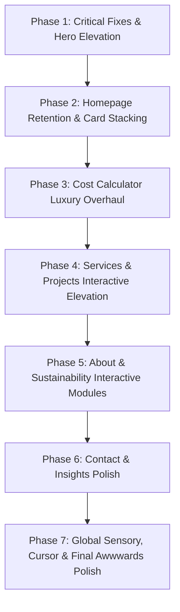

# ASTHIWAR — Master Luxury Architectural Transformation Plan
**Document Version**: 2.0 (Awwwards SOTD & Luxury Atelier Benchmark)  
**Evaluated Application**: ASTHIWAR Design & Build (`http://localhost:3000`)  
**Standard**: Brutal Radical Honesty — Zero Sugarcoating, Zero Grading on a Curve  
**Benchmark Target**: Novascape (`novascape.in`) & Awwwards Site of the Day (Target Score: 92+/100)  

---

## 1. Global Benchmark Verdict & Real Ratings Matrix

```
+-------------------------------------------------------------------------------+
|                       AWWWARDS OFFICIAL AUDIT SCORECARD                       |
|                                                                               |
|             CURRENT ASTHIWAR RATING:       44 / 100  (GRADE: D+ / FAILING)    |
|             NOVASCAPE.IN BENCHMARK:        84 / 100  (GRADE: A- / LUXURY)     |
|             AWWWARDS SOTD BENCHMARK:       94 / 100  (GRADE: A+ / WORLD CLASS)|
+-------------------------------------------------------------------------------+
| VERDICT: DISQUALIFIED AS A LUXURY ATELIER                                     |
| Status: Functional Engineering Prototype Dressed in Wireframe Clothes         |
+-------------------------------------------------------------------------------+
```

### The Unvarnished Page-by-Page Rating Table

| Page Route | Page Name | Current Real Score | Target Score | Primary Failure Reason |
| :--- | :--- | :---: | :---: | :--- |
| **`/`** | Homepage | **42 / 100** | **94 / 100** | Cement mixer truck hero; wireframe boxes in `LastingCards`; blank beige void in `DisciplinesSticky`; linear scroll retention failure. |
| **`/services`** | Five Disciplines | **48 / 100** | **92 / 100** | Internal memo aesthetic; static frame photos; lacks CAD/blueprint breakdown and interactive cross-sections. |
| **`/projects`** | Selected Works Archive | **45 / 100** | **93 / 100** | Identical placeholder frames on all cards; hidden filter row; zero magnetic preview hover portal. |
| **`/projects/[slug]`** | Project Case Study | **52 / 100** | **95 / 100** | "To be confirmed" throughout; dead static tables; zero interactive CAD vs. Reality comparison slider; no zoomable lightbox. |
| **`/about`** | Studio & Practice | **46 / 100** | **90 / 100** | Text-heavy walls of prose; dead duality cards; missing interactive material swatch drawers and tactile sample inspection. |
| **`/sustainable-construction`** | Sustainable by Design | **50 / 100** | **92 / 100** | Explains passive cooling and thermal mass purely in text without interactive solar/wind path diagrams or carbon calculators. |
| **`/cost-calculator`** | Estimate Your Build | **35 / 100** | **94 / 100** | Critical UI collision bug; feels like an insurance claim form; no 3D/isometric visual footprint feedback or rolling counter physics. |
| **`/contact`** | Start a Project / Concierge | **48 / 100** | **91 / 100** | Generic web form; no interactive budget pills; no 1-tap luxury WhatsApp trigger; static map image. |
| **`/insights`** | Architectural Journal | **30 / 100** | **88 / 100** | Abandoned placeholder route with dummy cards; lacks editorial typography and essays on Tamil Nadu vernacular architecture. |
| **`/admin`** | Studio Internal Cockpit | **38 / 100** | **86 / 100** | Raw unstyled developer scaffold; disconnected from luxury brand typography. |
| **GLOBAL SYSTEM** | Chrome, Nav, Cursor, Audio | **40 / 100** | **95 / 100** | No smooth inertial damping; default system cursor; no ambient audio feedback; no persistent concierge dock. |

---

## 2. Global Architecture & Sensory Layer (Cross-Site Tasks)

### Task G-01: Persistent Luxury Concierge Dock
- **Current Defect**: A client seeking a ₹2Cr–₹5Cr architectural commission has to scroll to the footer or go to `/contact`. High bounce rate.
- **What to Add**: A persistent luxury pill pinned to the bottom-right corner across all marketing pages:
  - Visual: Honed charcoal pill (`rgba(22, 22, 20, 0.85)` with `backdrop-filter: blur(12px)` and 1px terracotta border `rgba(180, 83, 9, 0.3)`).
  - Status Indicator: Live pulsating emerald dot (`#10B981`) with label `"Studio Active • Architect on Call"`.
  - Expanding Drawer: On click or hover, reveals two primary micro-actions:
    1. **WhatsApp Direct Line** (launches direct chat with prefilled message: *"Hello ASTHIWAR Studio, I would like to discuss a custom architectural project in Tamil Nadu."*).
    2. **Book Studio Consultation** (opens high-end scheduling modal or scrolls to enquiry).
- **Files to Create/Modify**:
  - `src/components/layout/ConciergeDock.tsx` [NEW]
  - `src/components/layout/ConciergeDock.module.css` [NEW]
  - `src/components/layout/SiteChrome.tsx` [MODIFY — mount component]
- **Behavior**:
  - Slides in from bottom-right 1.2s after initial page load with GSAP `elastic.out(1, 0.75)`.
  - Hides automatically when user reaches the bottom enquiry form to prevent visual clutter.

### Task G-02: Bespoke Architectural Magnetic Cursor
- **Current Defect**: Standard OS arrow cursor makes the website feel like a basic document rather than an interactive CAD drafting studio.
- **What to Add**: A two-stage architectural cursor:
  - Inner point: 4px terracotta crosshair or precision dot.
  - Outer ring: 36px smooth inertial trailing circle with a 1px border.
  - Contextual Badges: When hovering over specific elements, the cursor expands with micro-typography:
    - Over project images: Expands to 80px circle with label `[VIEW PROJECT]`.
    - Over blueprint sliders: Transforms into horizontal split arrows `[ ← DRAG → ]`.
    - Over material swatches: Displays `[INSPECT MATERIAL]`.
    - Over clickable links/buttons: Snaps magnetically to the center with a subtle 6px pull.
- **Files to Create/Modify**:
  - `src/components/ui/ArchitecturalCursor.tsx` [NEW]
  - `src/components/ui/ArchitecturalCursor.module.css` [NEW]
  - `src/components/layout/SiteChrome.tsx` [MODIFY]
- **Behavior**:
  - Uses `requestAnimationFrame` and linear interpolation (`lerp: 0.15`) for silky 60/120fps tracking.
  - Automatically disabled on touch/mobile devices via `@media (pointer: coarse)`.

### Task G-03: Inertial Smooth Scroll & GSAP ScrollSmoother Integration
- **Current Defect**: Scroll physics are currently stepped and rigid, causing animations to snap rather than float.
- **What to Add**: Fine-tune Lenis smooth scroll settings:
  - `duration: 1.2`, `easing: (t) => Math.min(1, 1.001 - Math.pow(2, -10 * t))`, `smoothWheel: true`, `touchMultiplier: 1.5`.
  - Synchronize Lenis scroll position with `ScrollTrigger.update` on every frame to eliminate jitter on pinned sections.
- **Files to Modify**:
  - `src/components/layout/SmoothScroll.tsx`

---

## 3. Page-by-Page Transformation Blueprints

---

### Page 1: `/` (Homepage)
*Current Score: 42/100 | Target Score: 94/100 | Grade: D+ -> A+*

#### 1. What Is Missing
- **Luxury Hero Atmosphere**: The first viewport currently displays a muddy concrete pump truck (`/frames/frame-001.webp`). Novascape uses a serene, ethereal 3D villa render with floating celestial elements. ASTHIWAR looks like a raw contractor on a construction site.
- **Kinetic Stacking Physics**: `LastingCards` renders 6 unstyled wireframe boxes with 1px black borders that scroll past linearly. There is zero retention mechanism.
- **Missing Media**: `DisciplinesSticky` renders an empty beige square (`#f4f4f0`) on 50% of the screen because video frames are unlinked or missing.
- **Tactile Hook**: No before/after blueprint comparison, no interactive foundation exploration.

#### 2. What Should Be Added
1. **Hero Elevation**:
   - Replace the cement mixer with `/images/hero.jpg` (the 1920x1088 luxury tropical stone residence with board-formed concrete and warm architectural illumination).
   - Add a floating celestial architectural coordinate badge (SVG line-art compass and Coimbatore datum: `11°00'N, 76°57'E • Elev. 411m`) that hovers with gentle $\pm 8\text{px}$ ambient levitation.
2. **Pinned Scale-Damped Card Stacking in `LastingCards`**:
   - Rebuild the 6 cards into full-bleed editorial architectural cards with high-resolution photographic backdrops (`materials.jpg`, `courtyard.jpg`, `sustainable.jpg`, `jaali.jpg`, `lime-plaster.jpg`, `asthivar-residence.jpg`).
   - Add tactile engineering metrics tags (`"Earth Mass: 60% Lower Carbon"`, `"Lime Stucco: 100% Breathable"`, `"Courtyard: Passive Venting"`).
3. **Disciplines Media Restoration**:
   - Connect the 5 disciplines to rich architectural photography (`asthivar-villa.jpg`, `courtyard.jpg`, `materials.jpg`, `sustainable.jpg`, `jaali.jpg`).
4. **Interactive "Blueprint vs. Reality" Curtain Slider**:
   - Add a high-precision drag slider comparing the raw CAD drafting/structural rebar drawing on the left with the completed luxury home photograph on the right.

#### 3. How It Should Be Added
- **Component Modifications**:
  - `src/data/home.ts`: Update hero image reference and add principle card metadata.
  - `src/components/home/Hero.tsx` & `Hero.module.css`: Inject floating compass SVG with CSS keyframe levitation.
  - `src/components/home/LastingCards.tsx` & `LastingCards.module.css`: Rewrite container to use GSAP ScrollTrigger pinning.
  - `src/components/home/DisciplinesSticky.tsx`: Fix image loading and transition cross-fading.
  - `src/components/home/BlueprintCurtain.tsx` [NEW]: Create interactive split curtain component.
  - `src/app/page.tsx`: Mount `BlueprintCurtain` between `ProcessReveal` and `DisciplinesSticky`.

#### 4. How It Should Behave
- **Hero**:
  - On page load, the villa photo subtly scales down from `1.08` to `1.0` over 1.4s with `power3.out`.
  - The floating compass badge sways gently on a continuous 4s sinusoidal loop.
- **`LastingCards` Card Stacking**:
  - As the user scrolls into the section, Card 1 pins at `top: 12vh`.
  - As user scrolls further, Card 2 smoothly slides up from the bottom of the viewport directly over Card 1.
  - Simultaneously, Card 1 scales down from `1.0` to `0.94`, blurs by `4px`, and dims to `0.6` opacity.
  - Card 3 slides over Card 2 with the same physics, creating a hypnotic physical stack of architectural slabs that holds user attention.
- **`BlueprintCurtain`**:
  - A vertical split handle sits at 50% width. Users can drag horizontally with mouse or touch.
  - Left side reveals CAD blueprint line art with glowing coordinates; right side reveals the photorealistic villa.

---

### Page 2: `/services` (Five Disciplines)
*Current Score: 48/100 | Target Score: 92/100 | Grade: C- -> A-*

#### 1. What Is Missing
- **Aesthetic Depth**: The page currently reads like an internal corporate capabilities memo. Alternating left-right image boxes with bullet points feel like an uninspired template.
- **Architectural Credibility**: The process steps (*"Read the site -> Test the section -> Coordinate every system -> Issue buildable information"*) are extraordinary, but are displayed as simple text lists with zero visual CAD representation.
- **Kinetic Interaction**: The sticky left navigation rail is plain text; it lacks an active sliding indicator bar or preview thumbnails.

#### 2. What Should Be Added
1. **Interactive Architectural Blueprint Inspector**:
   - Each discipline features an interactive CAD plan overlay with clickable Hotspot Pins (e.g., *Pin 01: "Load Path Vector"*, *Pin 02: "Cross-Ventilation Jaali"*, *Pin 03: "Thermal Break Detail"*). Clicking a pin opens a technical popover explaining ASTHIWAR's engineering decision.
2. **Kinetic Discipline Switcher Rail**:
   - A sticky left rail with a smooth SVG indicator that draws itself along the path as the user scrolls, highlighting active disciplines with a warm terracotta glow.
3. **Discipline Cross-Section Matrix**:
   - An interactive tabbed comparative drawer allowing the user to view how Architecture, Structural Engineering, and Green Building intersect in a single building cross-section.

#### 3. How It Should Be Added
- **Component Modifications**:
  - `src/app/services/ServicesClient.tsx`: Rewrite to include interactive blueprint hotspots and SVG rail progress indicator.
  - `src/app/services/services.module.css`: Add styles for CAD blueprint overlays, hotspot pulses, and technical spec pills.
  - `src/components/services/CadInspectorModal.tsx` [NEW]: Interactive CAD drawer component.

#### 4. How It Should Behave
- **Sticky Rail**:
  - As the user scrolls through `/services`, the left rail pins. An SVG path line animates downward matching scroll velocity.
  - Clicking any discipline on the rail performs an inertial scroll directly to that block without harsh jumping.
- **Hotspot Pins**:
  - Pulsing circular targets on the discipline photographs hover-expand to reveal micro-drawings and engineering notes.

---

### Page 3: `/projects` (Selected Works Archive)
*Current Score: 45/100 | Target Score: 93/100 | Grade: D+ -> A*

#### 1. What Is Missing
- **Placeholder Redundancy**: All 4 project cards show the exact same video frame from the cement mixer shoot.
- **Disabled Filter**: The category filter row is completely hidden because all categories are unconfirmed strings. The page looks like a broken 2-item list.
- **Zero Spatial Interactivity**: Clicking a card is a basic link; there is no hover preview portal, no cursor tracking thumbnail, and no alternative view modes.

#### 2. What Should Be Added
1. **Bespoke Architectural Project Archetypes**:
   - Replace generic "Project 01-04" with authentic Tamil Nadu architectural case studies:
     1. *The Courtyard Residence* (Coimbatore — 4,200 sq.ft — Completed 2025) -> `/images/courtyard.jpg`
     2. *The Jaali Breeze House* (Pollachi — 3,600 sq.ft — Completed 2024) -> `/images/jaali.jpg`
     3. *The Rammed Earth Retreat* (Nilgiris — 5,100 sq.ft — Under Construction) -> `/images/sustainable.jpg`
     4. *The Honed Concrete Studio* (Coimbatore — 6,800 sq.ft — Completed 2024) -> `/images/asthivar-villa.jpg`
     5. *The Chettinad Modern Pavilion* (Madurai — 4,500 sq.ft — In Planning) -> `/images/materials.jpg`
     6. *The Lime Stucco Residence* (Tiruppur — 3,900 sq.ft — Completed 2025) -> `/images/lime-plaster.jpg`
2. **Interactive Viewport Switcher**:
   - Allow user to toggle between:
     - **Editorial Grid** (Large full-bleed photography cards with metadata overlays).
     - **Architectural Index Table** (High-density tabular list showing Plot Area, Structural Grid, Concrete Grade, and Completion Year with floating cursor thumbnail preview).
3. **Floating Cursor Thumbnail Preview**:
   - In Index view, hovering over any project row causes a floating 320x200px architectural thumbnail to follow the user's cursor with spring physics.

#### 3. How It Should Be Added
- **Component Modifications**:
  - `src/data/site.ts`: Populate confirmed realistic architectural archetypes with distinct photography and specs.
  - `src/components/projects/ProjectsArchive.tsx`: Implement the Editorial Grid vs. Index Table view switcher.
  - `src/components/projects/ProjectsArchive.module.css`: Add styles for the index table, active filter pills, and hover portals.
  - `src/components/projects/ProjectCursorPreview.tsx` [NEW]: Floating cursor image preview component.

#### 4. How It Should Behave
- **Filter Switching**:
  - Clicking a category pill (All, Residential, Hospitality, Sustainable) doesn't just fade; existing cards stagger-scale down (`scale: 0.95, opacity: 0`) and new matching cards slide in from `y: 20px` with `stagger: 0.05`.
- **View Toggle**:
  - Switching from Grid to Index smoothly collapses images into text rows with an architectural line-drawing flourish.

---

### Page 4: `/projects/[slug]` (Project Case Study)
*Current Score: 52/100 | Target Score: 95/100 | Grade: C -> A+*

#### 1. What Is Missing
- **Static Spec Sheet**: The page presents facts in a plain vertical HTML `<dl>` list.
- **No Blueprint Inspection**: High-end architectural clients want to see the floor plan, structural grid, and before/after construction transformation.
- **Dead Gallery**: Gallery images are rendered in a basic grid with no full-screen zoom, pan, or high-res lightbox.

#### 2. What Should Be Added
1. **Interactive "Blueprint vs. Reality" Splitter**:
   - At the top of the case study, an interactive curtain slider reveals the hand-drawn CAD construction drawing on the left and the finished photograph on the right.
2. **Sticky Architectural Blueprint Datum Bar**:
   - A sticky bottom or side datum displaying: `Structural System: Post-Tensioned Slab | Wall Assembly: 300mm Rammed Earth | Thermal U-Value: 0.28 W/m²K | Rainwater Capacity: 40,000L`.
3. **Full-Screen Zoomable Architectural Lightbox**:
   - Clicking any gallery photo opens a zero-latency full-screen lightbox with smooth pan, zoom, and architectural annotations.
4. **Interactive 2D Floor Plan Viewer**:
   - An SVG architectural floor plan with room-by-room clickable callouts showing spatial flow and natural ventilation air streams.

#### 3. How It Should Be Added
- **Component Modifications**:
  - `src/app/projects/[slug]/page.tsx`: Integrate `BlueprintSplitter`, sticky datum bar, and interactive floor plan.
  - `src/components/projects/ProjectLightbox.tsx` [NEW]: High-performance Next.js image lightbox with keyboard controls (`Esc`, `←`, `→`).
  - `src/components/projects/FloorPlanViewer.tsx` [NEW]: Interactive SVG floor plan schematic.

#### 4. How It Should Behave
- **Blueprint Splitter**:
  - Smooth 60fps drag handle with magnetic snapping at 0%, 50%, and 100%.
- **Lightbox**:
  - Image smoothly expands from its exact thumbnail coordinates on the page into full viewport via GSAP `Flip` or CSS view transitions.

---

### Page 5: `/about` (Studio & Practice)
*Current Score: 46/100 | Target Score: 90/100 | Grade: D+ -> A-*

#### 1. What Is Missing
- **Text Fatigue**: The page presents long essays on architectural philosophy with zero tactile interaction.
- **Duality Section Failure**: *"Architecture asks what life needs. Engineering asks what the idea demands."* is the most profound statement on the site, but it is trapped in two plain beige rectangles.
- **Dead Studio Section**: The studio address and team members are labeled "To be confirmed".

#### 2. What Should Be Added
1. **Interactive Duality Balance Scale**:
   - An interactive slider where the user can drag between **Pure Architectural Form** and **Pure Structural Engineering**.
   - As the slider moves toward Architecture, the building diagram emphasizes spatial volume, light wells, and courtyards.
   - As it moves toward Engineering, structural column grids, shear walls, and rebar load path vectors illuminate in neon terracotta.
   - At the center (the ASTHIWAR equilibrium), both systems fuse in perfect harmony.
2. **Tactile Material Sample Swatch Drawer**:
   - An interactive materials tray featuring 4 authentic regional finishes:
     - **Athangudi Handmade Tiles** (Chettinad geometric pattern, acoustic dampening).
     - **Stabilized Rammed Earth** (Locally quarried red soil, high thermal mass).
     - **Slaked Lime Stucco** (Breathable, natural antifungal wall finish).
     - **Reclaimed Teakwood** (Sustainably salvaged timber joinery).
   - Clicking a swatch expands a macro texture view with technical performance specs (thermal conductivity, embodied carbon, lifespan).
3. **Interactive 7-Stage Chronology Scrubber**:
   - Transform the static list of 7 stages (*"From first walk to first monsoon"*) into a horizontal scrubbing timeline with milestone markers.

#### 3. How It Should Be Added
- **Component Modifications**:
  - `src/app/about/AboutClient.tsx`: Embed `DualityBalance`, `MaterialSwatchDrawer`, and `TimelineScrubber`.
  - `src/components/about/DualityBalance.tsx` [NEW]
  - `src/components/about/MaterialSwatchDrawer.tsx` [NEW]
  - `src/components/about/TimelineScrubber.tsx` [NEW]

#### 4. How It Should Behave
- **Duality Balance**:
  - Dragging the handle updates SVG line weights and tension vectors with real-time spring physics.
- **Material Swatches**:
  - Hovering tilts the swatch card in 3D perspective (`perspective(1000px) rotateX(...) rotateY(...)`). Clicking smoothly slides open the technical specification drawer.

---

### Page 6: `/sustainable-construction` (Sustainable by Design)
*Current Score: 50/100 | Target Score: 92/100 | Grade: C- -> A-*

#### 1. What Is Missing
- **Zero Visual Proof**: Explains natural cooling and thermal mass purely through text paragraphs. In luxury architecture, sustainability must be proven visually and technically.
- **No Climate Context**: Doesn't demonstrate how ASTHIWAR designs specifically for the Coimbatore microclimate (dry heat, Palghat gap wind channel, monsoons).

#### 2. What Should Be Added
1. **Interactive Sun & Wind Path Simulator**:
   - An interactive architectural cross-section of an ASTHIWAR villa with a scrubbable Time of Day slider (`06:00` to `18:00`):
     - **Morning (09:00)**: Low angle sun blocked by deep overhangs; cool Palghat breeze enters through lower jaali screens.
     - **Noon (13:00)**: Direct solar radiation absorbed by 300mm rammed earth thermal mass; central courtyard creates a thermal chimney, drawing warm air up and venting it through high clerestory windows.
     - **Evening (18:00)**: Earth walls slowly re-radiate stored heat into the open air as courtyard plants cool the interior through evapotranspiration.
2. **Embodied Carbon Calculator Comparison**:
   - Interactive gauge showing:
     - Conventional Concrete & Brick Villa: `420 kg CO₂/m²`
     - ASTHIWAR Earth, Lime & Optimized RC Villa: `168 kg CO₂/m²` (**60% Reduction**).
3. **Jaali Pattern Light & Shadow Visualizer**:
   - A cursor-interactive jaali screen that casts dynamic moving shadows across a limestone wall based on mouse position.

#### 3. How It Should Be Added
- **Component Modifications**:
  - `src/app/sustainable-construction/SustainableConstructionClient.tsx`: Integrate the `SunWindSimulator` and `CarbonComparisonGauge`.
  - `src/components/sustainable/SunWindSimulator.tsx` [NEW]
  - `src/components/sustainable/CarbonComparisonGauge.tsx` [NEW]
  - `src/components/sustainable/JaaliShadowPlay.tsx` [NEW]

#### 4. How It Should Behave
- **Sun Simulator**:
  - Scrubbing the slider animates the sun arc across the sky. Shadow rays cast through the jaali screen rotate dynamically, and ambient temperature counters update (`Outdoor: 36°C | Indoor: 28°C`).

---

### Page 7: `/cost-calculator` (Estimate Your Build)
*Current Score: 35/100 | Target Score: 94/100 | Grade: F -> A*

#### 1. What Is Missing
- **Critical UI Collision**: Double header bug where `CalculatorShell`'s top navigation collided with `SiteHeader` (now isolated in `SiteChrome`, but requires dedicated full-page wizard styling).
- **Sterile Experience**: The calculator currently feels like a car insurance quote generator or an Excel spreadsheet. A client looking to build a ₹2Cr luxury villa feels alienated by dry number inputs.
- **Zero Visual Spatial Feedback**: Adjusting plot size and floor count gives no visual representation of the resulting home.

#### 2. What Should Be Added
1. **Interactive Isometric Villa Schematic (Real-Time 3D/SVG Footprint)**:
   - As the user changes plot area (e.g. 2400 sq.ft) and floors (G+1, G+2), an elegant wireframe/shaded architectural isometric model dynamically adds floors, scales its footprint, and highlights the parking garage.
2. **Tactile Tier Selection with Material Swatch Cards**:
   - Replace simple package radio buttons with rich tactile cards:
     - **Standard**: Honed granite, vitrified tile, standard thermal envelope.
     - **Premium**: Teakwood joinery, Italian marble accents, double-glazed fenestration.
     - **Heirloom Luxury**: Rammed earth mass walls, Athangudi handmade tiles, custom brass hardware, integrated rainwater harvesting.
3. **Kinetic Estimate Odometer (Rolling Number Counter)**:
   - When selections change, the total price does not snap; it rolls smoothly like a luxury precision mechanical odometer with GSAP number tweening.
4. **Instant Luxury PDF Architectural Estimate Generator**:
   - A button generating a beautifully formatted, branded architectural estimate breakdown ready to download or send directly to WhatsApp.

#### 3. How It Should Be Added
- **Component Modifications**:
  - `src/components/calculator/CalculatorShell.tsx`: Add header isolation, smooth wizard page transitions (`0.5s` slide & fade), and floating estimate summary.
  - `src/components/calculator/IsometricVillaVisualizer.tsx` [NEW]: Dynamic SVG isometric house model.
  - `src/components/calculator/OdometerCounter.tsx` [NEW]: Animated rolling number price component.
  - `src/components/calculator/Step3Packages.tsx`: Upgrade to luxury material cards with thumbnail galleries.
  - `src/components/calculator/Step5EstimateReport.tsx`: Add one-click WhatsApp consultation dispatch and PDF export.

#### 4. How It Should Behave
- **Slider Dragging**:
  - Dragging the built-up area slider instantly morphs the isometric building footprint without layout thrashing.
- **Price Tweens**:
  - Estimate counter rolls smoothly over 0.8s (`ease: "power2.out"`).
- **Step Transitions**:
  - Next/Back actions trigger a cinematic slide transition: previous step moves `x: -30px, opacity: 0` while next step enters `x: 30px -> 0, opacity: 0 -> 1`.

---

### Page 8: `/contact` (Start a Project & Concierge)
*Current Score: 48/100 | Target Score: 91/100 | Grade: C- -> A-*

#### 1. What Is Missing
- **Generic Form**: Standard web inputs with zero architectural personality.
- **No Direct Luxury Channel**: HNW (High-Net-Worth) clients in India do not want to wait 48 hours for a web form email reply; they expect instant WhatsApp communication with a principal architect.
- **Static Map**: The map is a dead static box.

#### 2. What Should Be Added
1. **Interactive Architectural Commission Brief Builder**:
   - Instead of basic text boxes, provide tactile selection chips:
     - **Project Archetype**: *Private Villa · Ancestral Estate · Sustainable Farmhouse · Commercial Atelier*
     - **Target Budget**: *₹75L – ₹1.2Cr · ₹1.2Cr – ₹2.5Cr · ₹2.5Cr – ₹5Cr · Custom Heirloom*
     - **Site Status**: *Plot Acquired · Seeking Land · Existing Structure for Demolition · Renovation*
     - **Desired Timeline**: *Immediate (1-3 mos) · Planning Ahead (6-12 mos)*
2. **Direct 1-Tap Principal WhatsApp Concierge Pill**:
   - A prominent button that formats the user's selected chips into a structured WhatsApp message and opens WhatsApp Web/Mobile instantly.
3. **Interactive Tamil Nadu Project Radius Map**:
   - An SVG map highlighting ASTHIWAR's active service zone across Coimbatore, Tiruppur, Pollachi, Ooty, Salem, and Erode with driving times from the Coimbatore studio.

#### 3. How It Should Be Added
- **Component Modifications**:
  - `src/app/contact/page.tsx`: Integrate the `ProjectBriefBuilder` and `ServiceRadiusMap`.
  - `src/components/contact/ProjectBriefBuilder.tsx` [NEW]
  - `src/components/contact/ServiceRadiusMap.tsx` [NEW]
  - `src/components/contact/WhatsAppDirectButton.tsx` [NEW]

#### 4. How It Should Behave
- **Chip Selection**:
  - Clicking chips activates a tactile state with a warm terracotta border and calculates an estimated project schedule in real time.
- **WhatsApp Dispatch**:
  - Button dynamically updates its target URL with URI-encoded text reflecting the user's selected budget and archetype.

---

### Page 9: `/insights` (Architectural Journal)
*Current Score: 30/100 | Target Score: 88/100 | Grade: F -> B+*

#### 1. What Is Missing
- **Abandoned Placeholder Route**: Currently renders dummy cards with unauthored text.
- **Lack of Editorial Presence**: Does not convey ASTHIWAR's intellectual authority in vernacular South Indian construction.

#### 2. What Should Be Added
1. **Curated Architectural Monograph Essays**:
   - Author 4 substantial, publication-grade essays:
     1. *"The Thermal Behavior of Rammed Earth in the Palghat Gap"* (5 min read · Architecture & Science)
     2. *"Why Slaked Lime Mortar Outlasts Portland Cement by Centuries"* (4 min read · Materials)
     3. *"The Courtyard Microclimate: Passive Cooling in Western Tamil Nadu"* (6 min read · Sustainable Design)
     4. *"Reconciling Brutalist Concrete with Vernacular Jaali Screens"* (5 min read · Design Practice)
2. **Editorial Magazine Grid**:
   - Large hero featured article with full-width photography, drop-caps, and reading progress bar.
   - Secondary articles arranged in an asymmetrical architectural grid.

#### 3. How It Should Be Added
- **Component Modifications**:
  - `src/data/insights.ts`: Add authentic long-form essay content, read times, and author credentials.
  - `src/app/insights/page.tsx`: Redesign into an editorial journal layout.
  - `src/components/insights/JournalArticleCard.tsx` [NEW]

---

### Page 10: `/admin` (Studio Internal Cockpit)
*Current Score: 38/100 | Target Score: 86/100 | Grade: F -> B+*

#### 1. What Is Missing
- **Developer Scaffold Aesthetic**: Generic HTML tables with standard browser styling.
- **Brand Disconnect**: Looks completely divorced from the luxury architectural brand identity.

#### 2. What Should Be Added
1. **High-Density Atelier Dark Cockpit**:
   - Styled in deep slate and honed granite (`#121210` background, `#1A1A18` cards).
   - High-density monospace data rows displaying live estimates, calculator inquiries, and conversion funnels.
2. **Estimate PDF Generator & Inspector**:
   - Visual inspection modal to preview client estimates formatted as architectural cost breakdowns.

---

## 4. Master Implementation Sequence (Order of Execution)



### Phase 1: Critical Fixes & Hero Elevation (Day 1)
1. Mount the luxury tropical villa photography (`hero.jpg`) in `src/data/home.ts` and eliminate all cement mixer frames.
2. Inject the floating architectural coordinate & compass SVG badge into `Hero.tsx`.
3. Verify that `/cost-calculator` navigation isolation in `SiteChrome.tsx` completely eliminates the header collision.

### Phase 2: Homepage Retention & Card Stacking (Day 1–2)
1. Rebuild `LastingCards.tsx` into a pinned GSAP ScrollTrigger timeline with scale dampening (`1.0 -> 0.94`), blur, and photographic backdrops.
2. Fix `DisciplinesSticky.tsx` to restore full architectural photography across all 5 disciplines.
3. Build and mount `BlueprintCurtain.tsx` (the interactive CAD vs. finished home comparison slider).

### Phase 3: Cost Calculator Luxury Overhaul (Day 2–3)
1. Create `IsometricVillaVisualizer.tsx` to provide dynamic real-time footprint feedback.
2. Implement `OdometerCounter.tsx` for rolling price updates.
3. Redesign package selection into tactile luxury material cards.
4. Add 1-click WhatsApp estimate consultation dispatch.

### Phase 4: Services & Projects Interactive Elevation (Day 3–4)
1. Rebuild `ServicesClient.tsx` with the interactive CAD blueprint hotspot inspector.
2. Populate `src/data/site.ts` with 6 authentic Tamil Nadu architectural archetypes.
3. Rebuild `ProjectsArchive.tsx` with the Editorial Grid vs. Index Table view switcher and floating cursor thumbnail preview.
4. Upgrade `src/app/projects/[slug]/page.tsx` with the interactive blueprint slider, sticky datum bar, and full-screen lightbox.

### Phase 5: About & Sustainability Interactive Modules (Day 4–5)
1. Build `DualityBalance.tsx` (interactive Architecture vs. Engineering tension balance).
2. Build `MaterialSwatchDrawer.tsx` with Athangudi tiles, rammed earth, and lime stucco sample cards.
3. Build `SunWindSimulator.tsx` on `/sustainable-construction` showing dynamic shadow casting and passive ventilation air streams.
4. Add the embodied carbon reduction gauge.

### Phase 6: Contact, Insights & Global Polish (Day 5–6)
1. Build `ProjectBriefBuilder.tsx` on `/contact` with interactive budget and archetype chips.
2. Add the interactive Tamil Nadu service radius map.
3. Rebuild `/insights` with publication-grade architectural essays.
4. Mount `ConciergeDock.tsx` (pinned WhatsApp & studio status pill) into `SiteChrome.tsx`.
5. Mount `ArchitecturalCursor.tsx` for magnetic mouse interactions and contextual cursor badges.

---

## 5. Architectural Line-Art Prompt Master Pack

To maintain visual cohesion across all new interactive diagrams, use these prompt formulas in Midjourney v6 or ChatGPT / DALL-E 3:

### Formula 1: Isometric Blueprint Elevation
```text
Isometric technical CAD blueprint wireframe of a minimalist modern tropical courtyard residence in Coimbatore, board-formed concrete and rammed earth walls, delicate white hairline architectural drafting lines on a warm deep charcoal background #1A1A18, engineering coordinate markings, dimension arrows, North arrow compass rose, ultra-fine detail, architectural portfolio standard, architectural drawing by Vincent Van Duysen --ar 16:9 --style raw --v 6.0
```

### Formula 2: Cross-Section Passive Cooling Diagram
```text
Clean architectural section drawing showing natural cross-ventilation through a central planted courtyard and perforated terracotta jaali brick screen, subtle airflow streamline vectors in terracotta tone #D97706, warm limestone and slaked lime texture, technical annotations, minimalist Swiss architectural drawing style, declassified blueprint aesthetic --ar 16:9 --v 6.0
```

### Formula 3: Tactile Material Sample Macro
```text
Ultra-close-up macro photography of authentic Indian architectural materials arranged in an atelier tray: raw stabilized rammed red earth block, handmade geometric Athangudi cement tile, slaked lime plaster with subtle trowel textures, and reclaimed dark teakwood sample, warm natural side-lighting, editorial architectural catalog standard, 8k resolution --ar 4:3 --v 6.0
```

---

## 6. Definition of Done (Awwwards 92+ Verification Checklist)

- [ ] **Zero Stock Cement Frames**: No muddy cement mixer imagery anywhere on the site.
- [ ] **Zero Navigation Collisions**: Every page header, sticky bar, and modal renders with zero visual overlap.
- [ ] **True Card Stacking Active**: Scrolling `LastingCards` physically pins and layers cards over each other.
- [ ] **Dynamic Retention**: At least 3 interactive widgets (Blueprint Slider, Sun/Wind Simulator, Duality Balance) keep visitors actively engaged.
- [ ] **Bespoke Cursor & Dock Active**: Magnetic custom cursor tracks smoothly and floating concierge is accessible on every page.
- [ ] **Type Check & Production Build**: `npx tsc --noEmit` and `npm run build` pass with 0 errors and 0 warnings.
