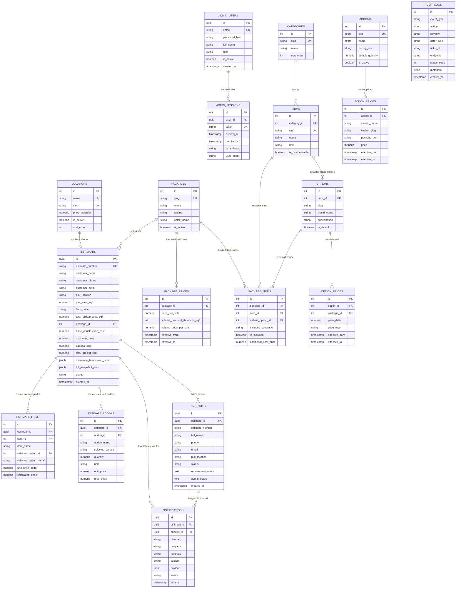

# ASTHIWAR DESIGN & BUILD — Database Architecture, Schema Specification & Relational Models

**Document Version:** 1.0.0  
**Database Engine:** Neon Serverless PostgreSQL (PostgreSQL 16)  
**ORM & Migration Tool:** Drizzle ORM / Drizzle Kit  
**Package:** `@asthiwar/database` (Monorepo Workspace)

---

## 1. Architectural Principles & Design Strategy

The ASTHIWAR database architecture is built upon four core engineering principles:

1. **Strict Immutability & Price Versioning (Mandatory Rules 7 & 8):**
   - Live pricing data (`package_prices`, `addon_prices`, `option_prices`) is **never overwritten or hard-deleted**.
   - Price modifications set `effective_to = NOW()` on the existing row and insert a new active row with `effective_from = NOW()` and `effective_to = NULL`.
   - Every generated estimate permanently preserves the exact material rates and pricing formulas active at the moment of calculation.
2. **Authoritative Estimation Snapshots:**
   - The `estimates` table stores normalized relational records in `estimate_items` and `estimate_addons`, while also embedding a complete, standalone `full_snapshot_json` and `milestone_breakdown_json`.
   - This ensures estimates remain 100% reproducible and verifiable for legal contract drafting and PDF generation even if future catalog specifications change.
3. **Cryptographic & Session Security:**
   - Salted 12-round Bcrypt password hashing (`password_hash`).
   - 7-day cryptographic 64-byte session tokens stored in `admin_sessions` with explicit revocation timestamps (`revoked_at`).
4. **Comprehensive System & Audit Observability:**
   - Dedicated `audit_logs` table capturing operational mutations, calculator submissions, and API errors with automatic sensitive parameter scrubbing.
   - Dedicated `notifications` table auditing omnichannel delivery (Email, WhatsApp, SMS).

---

## 2. Complete Entity Relationship Diagram (ERD)

---

## 3. Comprehensive Table Specifications

---

### 🛡️ Table 1: `admin_users`
Stores administrative identities with salted Bcrypt passwords and role-based permissions.

* **Schema File:** [`database/src/schema/admin.ts`](file:///d:/Aswin/Projects/Asthiwar/Asthiwar_v1/database/src/schema/admin.ts)

| Column | Data Type | Constraints | Default | Description |
|---|---|---|---|---|
| `id` | `UUID` | `PRIMARY KEY` | `gen_random_uuid()` | Unique administrator UUID |
| `email` | `TEXT` | `NOT NULL, UNIQUE` | — | Administrator login email |
| `password_hash` | `TEXT` | `NOT NULL` | — | 12-round salted Bcrypt password hash |
| `full_name` | `TEXT` | `NOT NULL` | — | Full name of the administrator |
| `role` | `TEXT` | `NOT NULL` | `'ADMIN'` | Role (`ADMIN`, `SUPER_ADMIN`) |
| `is_active` | `BOOLEAN` | `NOT NULL` | `true` | Active status flag |
| `created_at` | `TIMESTAMP WITH TIME ZONE` | `NOT NULL` | `NOW()` | Record creation timestamp |
| `updated_at` | `TIMESTAMP WITH TIME ZONE` | `NOT NULL` | `NOW()` | Last modification timestamp |

---

### 🔑 Table 2: `admin_sessions`
Stores 7-day server-side session tokens for authenticated administrative access.

* **Schema File:** [`database/src/schema/admin.ts`](file:///d:/Aswin/Projects/Asthiwar/Asthiwar_v1/database/src/schema/admin.ts)

| Column | Data Type | Constraints | Default | Description |
|---|---|---|---|---|
| `id` | `UUID` | `PRIMARY KEY` | `gen_random_uuid()` | Session UUID |
| `user_id` | `UUID` | `NOT NULL, FK -> admin_users(id)` | — | Cascade-deleted when user is deleted |
| `token` | `TEXT` | `NOT NULL, UNIQUE` | — | Cryptographic 64-byte session token |
| `expires_at` | `TIMESTAMP WITH TIME ZONE` | `NOT NULL` | — | Expiration timestamp (7 days from issue) |
| `ip_address` | `TEXT` | `NULLABLE` | — | Client IP at time of login |
| `user_agent` | `TEXT` | `NULLABLE` | — | Client browser User-Agent |
| `created_at` | `TIMESTAMP WITH TIME ZONE` | `NOT NULL` | `NOW()` | Session login timestamp |

---

### 📍 Table 3: `locations`
Defines operational Tamil Nadu cities and regional material/labor price multipliers.

* **Schema File:** [`database/src/schema/locations.ts`](file:///d:/Aswin/Projects/Asthiwar/Asthiwar_v1/database/src/schema/locations.ts)

| Column | Data Type | Constraints | Default | Description |
|---|---|---|---|---|
| `id` | `SERIAL` | `PRIMARY KEY` | Auto-increment | Unique location integer ID |
| `name` | `TEXT` | `NOT NULL, UNIQUE` | — | City name (e.g. *Chennai, Coimbatore, Pollachi*) |
| `slug` | `TEXT` | `NOT NULL, UNIQUE` | — | URL-friendly lowercase slug (*chennai, coimbatore*) |
| `price_multiplier` | `NUMERIC(6,4)` | `NOT NULL` | `1.0000` | Cost multiplier index (e.g. `1.0500` for Chennai) |
| `is_active` | `BOOLEAN` | `NOT NULL` | `true` | Active status flag |
| `sort_order` | `INTEGER` | `NOT NULL` | `0` | UI display sort index |
| `created_at` | `TIMESTAMP WITH TIME ZONE` | `NOT NULL` | `NOW()` | Record creation timestamp |
| `updated_at` | `TIMESTAMP WITH TIME ZONE` | `NOT NULL` | `NOW()` | Last update timestamp |

---

### 📦 Table 4: `packages` & `package_prices`
Defines the 4 core construction quality tiers and their versioned standard/volume rates.

* **Schema File:** [`database/src/schema/packages.ts`](file:///d:/Aswin/Projects/Asthiwar/Asthiwar_v1/database/src/schema/packages.ts)

#### `packages` Table:
| Column | Data Type | Constraints | Default | Description |
|---|---|---|---|---|
| `id` | `SERIAL` | `PRIMARY KEY` | Auto-increment | Unique package integer ID |
| `slug` | `TEXT` | `NOT NULL, UNIQUE` | — | Tier slug (`basic`, `standard`, `premium`, `luxury`) |
| `name` | `TEXT` | `NOT NULL` | — | Package title (*Basic Package, Standard Package*) |
| `tagline` | `TEXT` | `NOT NULL` | — | Marketing subtitle (*Entry Level, Budget Friendly*) |
| `description` | `TEXT` | `NULLABLE` | — | Overview of package quality & inclusions |
| `color_theme` | `TEXT` | `NULLABLE` | — | UI badge & theme token (e.g. `#D97706`) |
| `is_active` | `BOOLEAN` | `NOT NULL` | `true` | Active visibility flag |
| `sort_order` | `INTEGER` | `NOT NULL` | `0` | Display order (0 = Basic, 3 = Luxury) |

#### `package_prices` Table (Immutable Versioning):
| Column | Data Type | Constraints | Default | Description |
|---|---|---|---|---|
| `id` | `SERIAL` | `PRIMARY KEY` | Auto-increment | Price version ID |
| `package_id` | `INTEGER` | `NOT NULL, FK -> packages(id)` | — | Parent package reference |
| `price_per_sqft` | `NUMERIC(10,2)` | `NOT NULL` | — | Standard rate per sq.ft ($\le 3,500\text{ sq.ft}$) |
| `volume_discount_threshold_sqft` | `INTEGER` | `NOT NULL` | `3500` | Area threshold triggering volume rate |
| `volume_price_per_sqft` | `NUMERIC(10,2)` | `NOT NULL` | — | Discounted rate per sq.ft ($> 3,500\text{ sq.ft}$) |
| `effective_from` | `TIMESTAMP WITH TIME ZONE` | `NOT NULL` | `NOW()` | Start of pricing validity |
| `effective_to` | `TIMESTAMP WITH TIME ZONE` | `NULLABLE` | `NULL` | End of pricing validity (`NULL` = Currently active) |
| `created_at` | `TIMESTAMP WITH TIME ZONE` | `NOT NULL` | `NOW()` | Version creation timestamp |

---

### 🧱 Table 5: Specifications Matrix (`categories`, `items`, `options`, `package_items`, `option_prices`)

* **Schema File:** [`database/src/schema/specifications.ts`](file:///d:/Aswin/Projects/Asthiwar/Asthiwar_v1/database/src/schema/specifications.ts)

1. **`categories`:** Groups specifications into 10 engineering areas (`structure`, `design`, `management`, `kitchen`, `bathroom`, `flooring`, `doors_windows`, `painting`, `electrical`, `other`).
2. **`items`:** Individual material items (e.g., `steel_rebar`, `cement`, `masonry_work`, `ceiling_height`, `waterproofing`).
3. **`options`:** Brand choices for an item (e.g., `tata_steel`, `ultratech_cement`, `red_bricks`, `kohler_sanitary`).
4. **`package_items`:** Links a package to an item with its default included option and allowance details.
5. **`option_prices`:** Stores versioned upgrade rate deltas ($\Delta \text{ / sq.ft}$) for non-default selections.

---

### 🛠️ Table 6: `addons` & `addon_prices`
Defines 15 specialized civil infrastructure options and their variant unit prices.

* **Schema File:** [`database/src/schema/addons.ts`](file:///d:/Aswin/Projects/Asthiwar/Asthiwar_v1/database/src/schema/addons.ts)

| Column | Data Type | Constraints | Default | Description |
|---|---|---|---|---|
| `id` | `SERIAL` | `PRIMARY KEY` | Auto-increment | Unique add-on ID |
| `slug` | `TEXT` | `NOT NULL, UNIQUE` | — | Add-on identifier (`sump`, `septic_tank`, `solar`, `lift`) |
| `name` | `TEXT` | `NOT NULL` | — | Full display name (*Underground Sump, Rooftop Solar*) |
| `description` | `TEXT` | `NULLABLE` | — | Engineering notes & capacity guidance |
| `pricing_unit` | `TEXT` | `NOT NULL` | — | Unit (`per_litre`, `per_rft`, `fixed`, `per_sqft`) |
| `default_quantity` | `NUMERIC(10,2)` | `NULLABLE` | — | Suggested default size (e.g., `5000` for sump) |
| `is_active` | `BOOLEAN` | `NOT NULL` | `true` | Active status flag |

#### `addon_prices` Table (Immutable Versioning):
| Column | Data Type | Constraints | Default | Description |
|---|---|---|---|---|
| `id` | `SERIAL` | `PRIMARY KEY` | Auto-increment | Add-on price version ID |
| `addon_id` | `INTEGER` | `NOT NULL, FK -> addons(id)` | — | Parent add-on reference |
| `variant_name` | `TEXT` | `NOT NULL` | — | Specification variant (*Fly ash brick, 3 kW Solar*) |
| `variant_slug` | `TEXT` | `NOT NULL` | — | Variant slug (*flyash*, *3kw*, *red_brick*) |
| `package_tier` | `TEXT` | `NOT NULL` | `'all'` | Applicable tiers (`all`, `basic_standard`, `premium_luxury`) |
| `price` | `NUMERIC(12,2)` | `NOT NULL` | — | Unit price (e.g. `26.00` for ₹26/L, `180000.00` flat) |
| `effective_from` | `TIMESTAMP WITH TIME ZONE` | `NOT NULL` | `NOW()` | Validity start date |
| `effective_to` | `TIMESTAMP WITH TIME ZONE` | `NULLABLE` | `NULL` | Validity end date (`NULL` = Active) |

---

### 📋 Table 7: Estimates System (`estimates`, `estimate_items`, `estimate_addons`)

* **Schema File:** [`database/src/schema/estimates.ts`](file:///d:/Aswin/Projects/Asthiwar/Asthiwar_v1/database/src/schema/estimates.ts)

#### `estimates` Table (Master Authoritative Snapshot):
| Column | Data Type | Constraints | Default | Description |
|---|---|---|---|---|
| `id` | `UUID` | `PRIMARY KEY` | `gen_random_uuid()` | Unique estimate UUID |
| `estimate_number` | `TEXT` | `NOT NULL, UNIQUE` | — | Permanent human identifier (`EST-YYYY-XXXXXX`) |
| `customer_name` | `TEXT` | `NOT NULL` | — | Full customer name |
| `customer_phone` | `TEXT` | `NOT NULL` | — | 10-digit customer mobile |
| `customer_email` | `TEXT` | `NOT NULL` | — | Customer email address |
| `plot_location` | `TEXT` | `NOT NULL` | — | Project city location |
| `location_multiplier` | `NUMERIC(6,4)` | `NOT NULL` | `1.0000` | City index applied at calculation time |
| `plot_area_sqft` | `NUMERIC(10,2)` | `NOT NULL` | — | Normalized plot area in square feet |
| `builtup_area_per_floor_sqft` | `NUMERIC(10,2)` | `NOT NULL` | — | Single-floor ground footprint |
| `floor_count` | `TEXT` | `NOT NULL` | — | Elevation height (`Ground`, `G+1`, `G+2`, `G+3`) |
| `floor_multiplier` | `NUMERIC(6,4)` | `NOT NULL` | `1.0000` | Numerical floor multiplier (1.0, 2.0, 3.0, 4.0) |
| `car_parking_area_sqft`| `NUMERIC(10,2)` | `NOT NULL` | `0.00` | Covered parking area in sq.ft |
| `total_builtup_area_sqft` | `NUMERIC(10,2)`| `NOT NULL` | — | Cumulative construction area |
| `package_id` | `INTEGER` | `NOT NULL, FK -> packages(id)`| — | Package tier reference |
| `package_slug` | `TEXT` | `NOT NULL` | — | Package slug snapshot |
| `package_rate_per_sqft` | `NUMERIC(10,2)`| `NOT NULL` | — | Base rate/sq.ft snapshot |
| `base_construction_cost` | `NUMERIC(12,2)`| `NOT NULL` | — | Total base civil cost |
| `upgrades_cost` | `NUMERIC(12,2)`| `NOT NULL` | `0.00` | Total brand upgrade additions |
| `addons_cost` | `NUMERIC(12,2)`| `NOT NULL` | `0.00` | Total infrastructure add-on costs |
| `total_project_cost` | `NUMERIC(12,2)`| `NOT NULL` | — | Grand Total Project Investment |
| `milestone_breakdown_json` | `JSONB` | `NOT NULL` | — | 10-stage payment schedule JSON |
| `full_snapshot_json` | `JSONB` | `NOT NULL` | — | Complete calculation state snapshot |
| `status` | `TEXT` | `NOT NULL` | `'DRAFT'` | Status (`DRAFT`, `GENERATED`, `SENT`) |
| `created_at` | `TIMESTAMP WITH TIME ZONE` | `NOT NULL` | `NOW()` | Estimate timestamp |

#### `estimate_items` Table:
Stores line-item brand specification customizations selected for this estimate.

#### `estimate_addons` Table:
Stores selected infrastructure add-ons, chosen sizing, unit rates, and totals.

---

### 📞 Table 8: `enquiries` (CRM Lead Capture)
Stores consultation booking requests and site visit leads.

* **Schema File:** [`database/src/schema/enquiries.ts`](file:///d:/Aswin/Projects/Asthiwar/Asthiwar_v1/database/src/schema/enquiries.ts)

| Column | Data Type | Constraints | Default | Description |
|---|---|---|---|---|
| `id` | `UUID` | `PRIMARY KEY` | `gen_random_uuid()` | Unique enquiry UUID |
| `estimate_id` | `UUID` | `NULLABLE, FK -> estimates(id)` | — | Linked estimate UUID (if generated) |
| `estimate_number` | `TEXT` | `NULLABLE` | — | Linked estimate number (e.g. `EST-2026-172166`) |
| `full_name` | `TEXT` | `NOT NULL` | — | Customer full name |
| `phone` | `TEXT` | `NOT NULL` | — | 10-digit contact mobile |
| `email` | `TEXT` | `NOT NULL` | — | Contact email |
| `plot_location` | `TEXT` | `NOT NULL` | — | Project location |
| `status` | `TEXT` | `NOT NULL` | `'NEW'` | CRM Status (`NEW`, `CONTACTED`, `IN_PROGRESS`, `CLOSED`, `ARCHIVED`) |
| `requirement_notes` | `TEXT` | `NULLABLE` | — | Customer requirements / preferred consultation slot |
| `admin_notes` | `TEXT` | `NULLABLE` | — | Sales engineer follow-up notes |
| `created_at` | `TIMESTAMP WITH TIME ZONE` | `NOT NULL` | `NOW()` | Submission timestamp |

---

### 📨 Table 9: `notifications` (Omnichannel Audit)
Stores every email, WhatsApp, and SMS delivery attempt.

* **Schema File:** [`database/src/schema/notifications.ts`](file:///d:/Aswin/Projects/Asthiwar/Asthiwar_v1/database/src/schema/notifications.ts)

| Column | Data Type | Constraints | Default | Description |
|---|---|---|---|---|
| `id` | `UUID` | `PRIMARY KEY` | `gen_random_uuid()` | Unique notification UUID |
| `estimate_id` | `UUID` | `NULLABLE, FK -> estimates(id)` | — | Related estimate |
| `enquiry_id` | `UUID` | `NULLABLE, FK -> enquiries(id)` | — | Related enquiry |
| `channel` | `TEXT` | `NOT NULL` | — | Channel (`EMAIL`, `WHATSAPP`, `SMS`) |
| `recipient` | `TEXT` | `NOT NULL` | — | Email address or phone number |
| `template` | `TEXT` | `NOT NULL` | — | Template (`ESTIMATE_QUOTATION`, `NEW_LEAD_ALERT`) |
| `subject` | `TEXT` | `NULLABLE` | — | Email subject or message header |
| `payload` | `JSONB` | `NULLABLE` | — | Dispatched HTML / text content |
| `status` | `TEXT` | `NOT NULL` | `'PENDING'` | Delivery status (`PENDING`, `SENT`, `FAILED`) |
| `sent_at` | `TIMESTAMP WITH TIME ZONE` | `NULLABLE` | — | Timestamp of dispatch |

---

### 🛡️ Table 10: `audit_logs` (System & Security Audit)
Asynchronously records all administrative price mutations, calculator submissions, and API errors.

* **Schema File:** [`database/src/schema/auditLogs.ts`](file:///d:/Aswin/Projects/Asthiwar/Asthiwar_v1/database/src/schema/auditLogs.ts)

| Column | Data Type | Constraints | Default | Description |
|---|---|---|---|---|
| `id` | `SERIAL` | `PRIMARY KEY` | Auto-increment | Unique log entry ID |
| `event_type` | `TEXT` | `NOT NULL` | — | Classification (`ERROR`, `WARN`, `INFO`, `ADMIN_MUTATION`, `CALCULATOR_SUBMISSION`) |
| `action` | `TEXT` | `NOT NULL` | — | Operation code (`UPDATE_PACKAGE_PRICE`, `AUTHORITATIVE_ESTIMATE_CREATED`, etc.) |
| `severity` | `TEXT` | `NOT NULL` | `'INFO'` | Severity (`LOW`, `MEDIUM`, `HIGH`, `CRITICAL`) |
| `actor_type` | `TEXT` | `NOT NULL` | `'ANONYMOUS_USER'` | Actor (`ADMIN`, `ANONYMOUS_USER`, `SYSTEM`) |
| `actor_id` | `TEXT` | `NULLABLE` | — | Admin email, user phone, or session ID |
| `endpoint` | `TEXT` | `NULLABLE` | — | API endpoint URL (e.g. `/api/v1/calculator/estimate`) |
| `http_method` | `TEXT` | `NULLABLE` | — | HTTP verb (`GET`, `POST`, `PUT`, `PATCH`, `DELETE`) |
| `status_code` | `INTEGER` | `NULLABLE` | — | HTTP response status code |
| `error_message` | `TEXT` | `NULLABLE` | — | Error text (if exception occurred) |
| `error_stack` | `TEXT` | `NULLABLE` | — | Stack trace (for 500 errors) |
| `metadata` | `JSONB` | `NULLABLE` | — | Sanitized payload & execution details (passwords redacted) |
| `ip_address` | `TEXT` | `NULLABLE` | — | Client IP address |
| `user_agent` | `TEXT` | `NULLABLE` | — | Client browser User-Agent string |
| `created_at` | `TIMESTAMP WITH TIME ZONE` | `NOT NULL` | `NOW()` | Timestamp of event |
